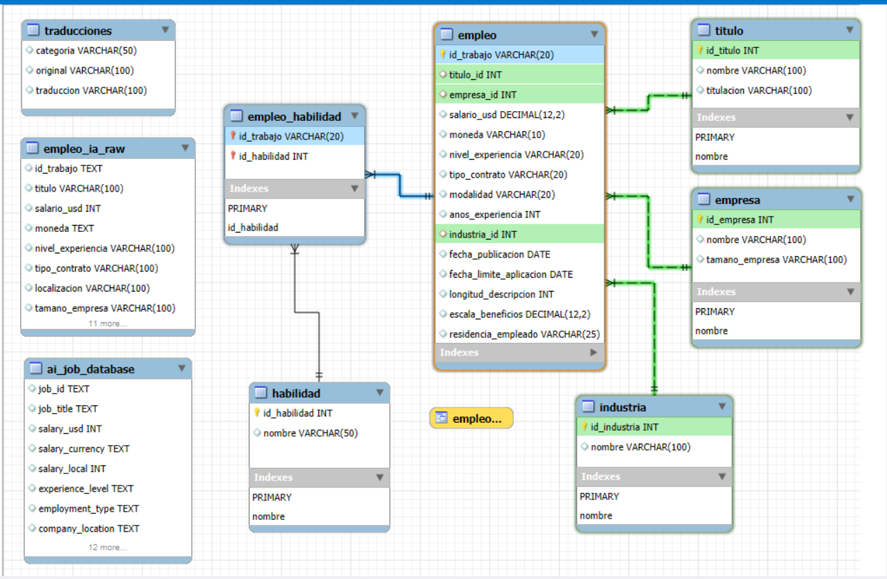
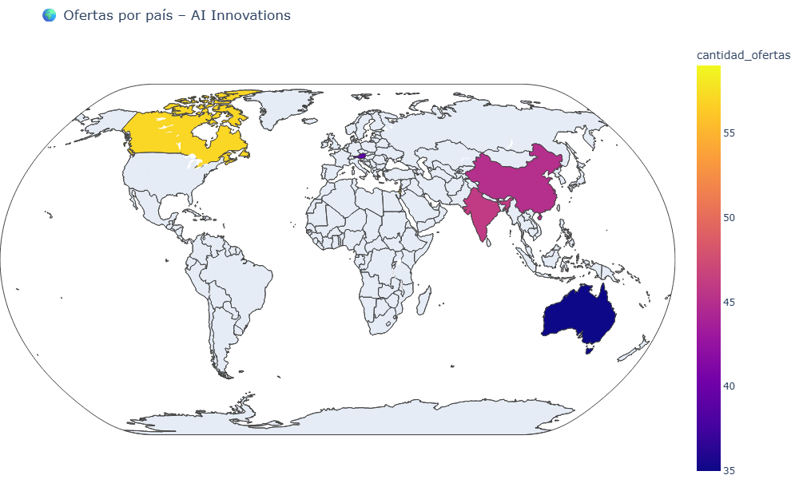
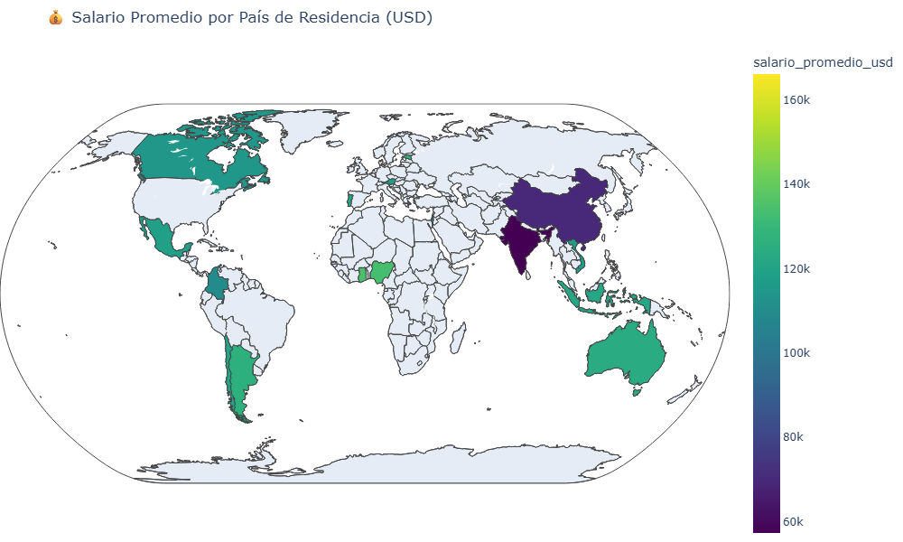
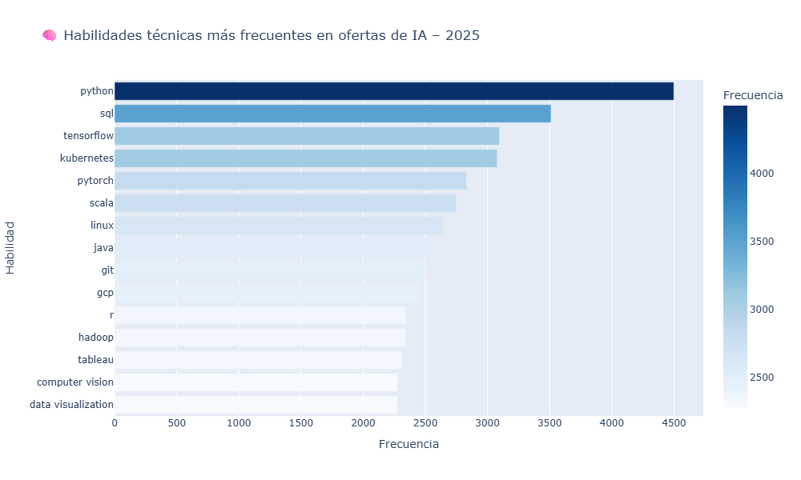
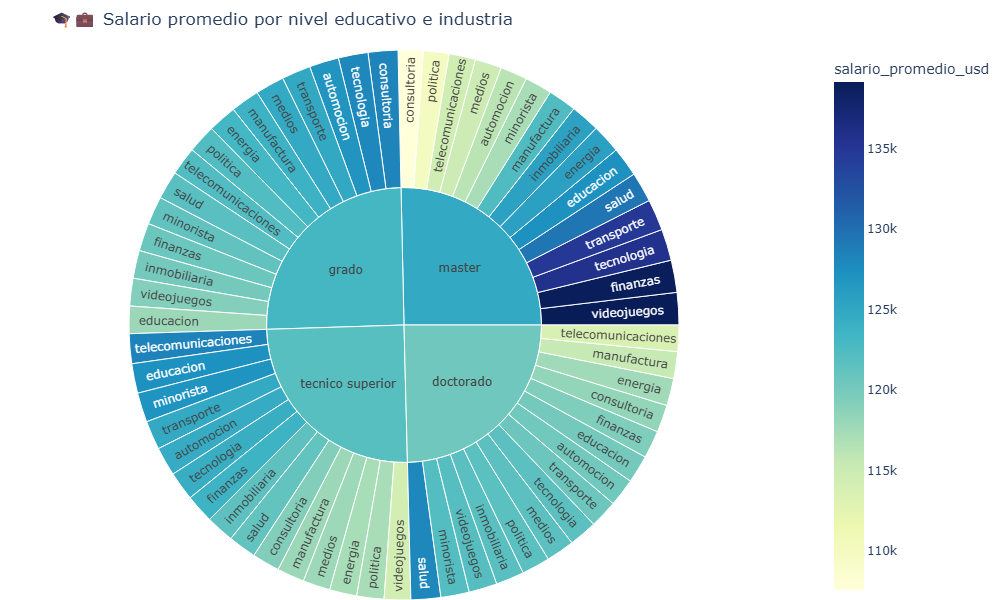

# ***📊 Proyecto Integrador Final***  

**Bootcamp de Análisis de Datos – UNICORN ACADEMY**  
<p align="center">
  
</p>

--- 
Este proyecto integrador representa la culminación del Bootcamp de Análisis de Datos, donde se aplican de forma conjunta las principales herramientas y metodologías aprendidas a lo largo de la formación.  

El análisis responde preguntas clave sobre compensación y tendencias laborales, integrando **SQL** para la gestión de datos, **Python** para el análisis estadístico y visualizaciones, y **Power BI** para la construcción de dashboards interactivos que apoyan la toma de decisiones estratégicas.  

Este trabajo marca un avance significativo respecto a proyectos anteriores, mostrando un progreso en mi formación como Analista de Datos, con técnicas más robustas y un enfoque integral en la presentación de resultados.  

🔎 **Objetivo principal**: analizar el mercado laboral en ciencia de datos e inteligencia artificial, explorando la relación entre salario, beneficios, experiencia y educación a partir de un conjunto de datos de Kaggle.  

💡 **Resultados clave**:  
- Análisis exploratorio y estadístico de los datos 
  
- Dashboards interactivos en **Power BI** 
   
- Modelado de bases de datos en **MySQL/SQLite** 
  
- Visualizaciones avanzadas con **Python (Pandas, Seaborn, Plotly)**     

---

## **📂Estructura del proyecto**

```
sql

Proyecto_Integrador_Final/
├── 📓 Notebook/                  # Jupyter notebooks del análisis principal
│   └── 📒 Proyecto_integrador_mercado_ia.ipynb
│
├── 📊 data/                     # Archivos CSV y datasets usados
│   ├── 📄 ai_job_database.csv
│   ├── 📄 habilidad.csv
│   ├── 📄 empleo.csv
│   ├── 📄 empleo_ia_raw.csv
│   ├── 📄 empresa.csv
│   ├── 📄 empleo_habilidad.csv
│   ├── 📄 industria.csv
│   ├── 📄 titulo.csv
│   └── 📄 traducciones.csv 
├── 🗄️ sql/                     # Consultas y scripts SQL  
│   ├── 📄 numero_ofertas_por_nivel_experiencia.sql
│   ├── 📄 ofertas_principiante_intermedio.sql
│   ├── 📄 rango_fechas_publicacion.sql
│   ├── 📄 regresion_lineal_salario.sql
│   ├── 📄 salario_por_educacion_industria.sql
│   ├── 📄 salario_por_experiencia.sql
│   ├── 📄 salario_por_experiencia_y_empresa.sql
│   ├── 📄 salario_por_modalidad.sql
│   ├── 📄 salario_por_tamano_empresa.sql
│   ├── 📄 salario_por_titulacion.sql
│   ├── 📄 salario_promedio_analista_por_modalidad_y_nivel.sql
│   ├── 📄 salario_promedio_analista_remoto.sql
│   ├── 📄 salario_promedio_por_residencia_empleado.sql
│   ├── 📄 salario_promedio_por_tamano_empresa.sql
│   ├── 📄 salario_promedio_top5_por_nivel.sql
│   ├── 📄 salario_promedio_top5traducido_por_nivel.sql
│   ├── 📄 titulo.sql
│   ├── 📄 top_habilidades.sql
│   ├── 📄 top_titulos_principiante_intermedio.sql
│   └── 📄 total_ofertas_por_modalidad.sql

├── 🧩 erd/                     # Modelo entidad-relación  
┃  └── 📐 ER_Proyecto_Integrador.mwb

├── 📈 powerbi/
    └── dashboard_final.pbix
 

├── 🛠️ utils/                   # Scripts de utilidad
│   ├── ⚙️ .env                  # Variables de entorno (🔒 protegido con .gitignore)
│   └── 🔗 db_connection.py      # Script para crear conexión segura a MySQL desde Python
  

├── 📤 exportados/              # Gráficos, informes y figuras  
┃   ├── 🖼️ iframe_figures/  
│   └── 🖼️ logo_unicorn.png          # Logo institucional  

```
## 📐 Diagrama ER del Data Mart


---

## **🛠️ Tecnologías utilizadas**  


---

## **📚 Recursos**

- 📂 [Dataset original de Kaggle](https://www.kaggle.com/datasets/bismasajjad/global-ai-job-market-and-salary-trends-2025?select=ai_job_dataset1.csv) – Datos sobre empleos en IA y ciencia de datos.  
- 💾 [Script SQL completo](sql/mercado_ia_final.sql) – Incluye la creación de tablas, normalización, inserciones de traducciones utilizadas en el análisis.
- 🗂️ [Consultas SQL](./sql/) – Scripts para replicar las consultas de análisis.  
- 📊 [Visualizaciones y figuras exportadas](./exportados/) – Gráficos y reportes generados en el proyecto.
- ## 📊 Visualizaciones destacadas

🌍 **Distribución geográfica de salarios**  


🏡 **Salario promedio por residencia**  


💡 **Habilidades más demandadas**  


🎓 **Relación entre educación, industria y salario**  


📈 **Evolución de ofertas vs salario promedio**  


### **📖 Documentación de librerías y herramientas**
- 📘 [Pandas](https://pandas.pydata.org/docs/) – Análisis de datos en Python.  
- 📗 [Seaborn](https://seaborn.pydata.org/) – Visualización estadística.  
- 📙 [Plotly](https://plotly.com/python/) – Gráficos interactivos.  
- 🟦 [SQLAlchemy](https://docs.sqlalchemy.org/) – Conexión y manejo de bases de datos.  
- 🟩 [python-dotenv](https://saurabh-kumar.com/python-dotenv/) – Gestión de credenciales y variables de entorno.  
- 🟨 [Power BI](https://learn.microsoft.com/es-es/power-bi/) – Dashboards interactivos.

---

### **📌 Conclusión**

  Este proyecto integrador explora el mercado laboral en el ámbito de la ciencia de datos e inteligencia artificial, analizando la relación entre salario, beneficios, experiencia profesional y educación mediante un enfoque integral que combina **SQL**, **Python** y **Power BI**.

  El análisis permitió identificar patrones clave en la compensación laboral, detectar las habilidades más demandadas y evaluar cómo influyen la educación, la experiencia y la modalidad de trabajo en los salarios.

***✨ Un cierre de bootcamp que marca el comienzo de nuevas oportunidades en mi camino como Analista de Datos.***
***💡 “Explorando datos, revelando decisiones.”***
